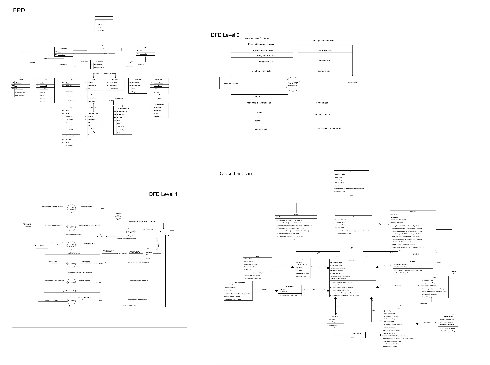
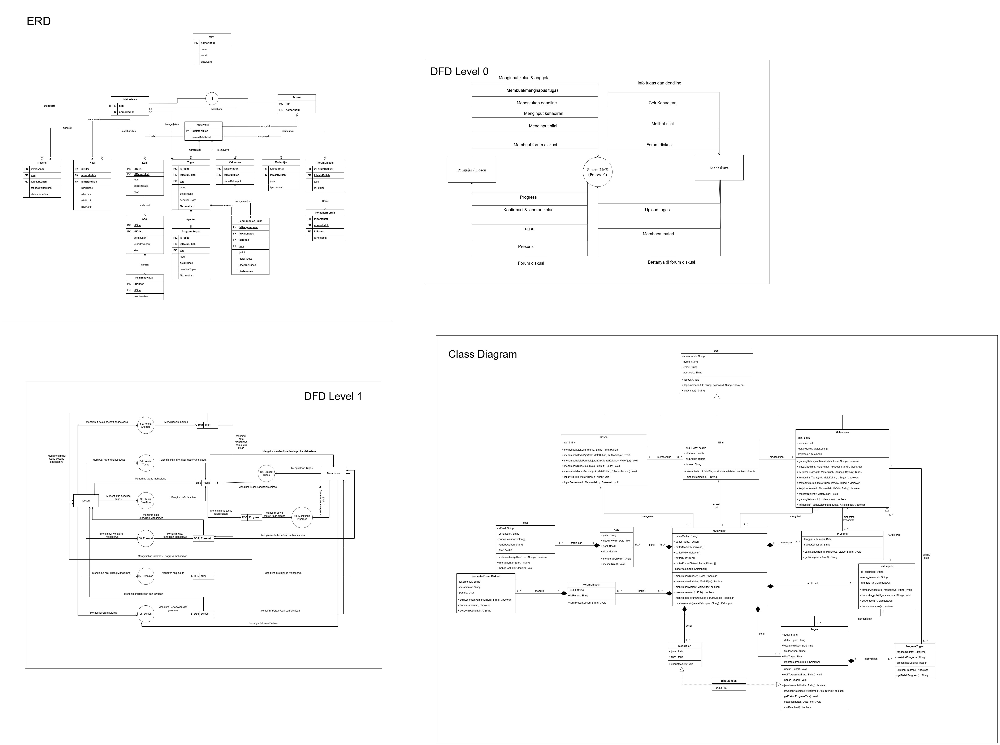

# 🎓 LeMas — Learning Machine System

> Platform pembelajaran berbasis web yang memudahkan dosen dalam mengelola kelompok dan memantau progress mahasiswa secara real-time.

---

## 👥 Informasi Kelompok

| Atribut | Detail |
| :--- | :--- |
| **Nama Kelompok** | Kelompok 8 |
| **Mata Kuliah** | Implementasi Perancangan Perangkat Lunak |
| **Dosen Pengampu** | Muhammad Shiddiq Azis, S.T., MBA |

**Anggota:**
1. Moch Firmansyah
2. Listianto Hilmi Fauzaan
3. Muhammad Daffa
4. Muhammad Lutfi Fitriansyah

---

## 📖 Tentang Proyek

**LeMas (Learning Machine System)** adalah platform pembelajaran yang memberi akses kepada dosen untuk mengelola kelompok dan memantau progress mahasiswa dengan mudah dan efisien.

---

## 🛠️ Teknologi yang Digunakan

| Komponen | Teknologi |
| :--- | :--- |
| **Frontend** | React.js, Vite, Tailwind CSS |
| **Backend** | Node.js, Express.js, Prisma |
| **Database** | PostgreSQL / MySQL |
| **Design** | Figma |

---

## 📊 Perancangan Sistem

Pastikan path folder `assets` berada di root repository kamu. Jika folder `assets` ada di luar, gunakan format berikut:

### DFD Level 0


### DFD Level 1


---

## 🗄️ Entity Relationship Diagram (ERD)


---

## 🏗️ Class Diagram



---

## 🎨 Mockup Antarmuka (Figma)

> [Klik di sini untuk melihat desain Figma](LINK_FIGMA_KAMU_DISINI)

---

## 🚀 Panduan Instalasi

### 1. Clone Repository
```bash
git clone [https://github.com/username/lemas.git](https://github.com/username/lemas.git)
cd lemas
