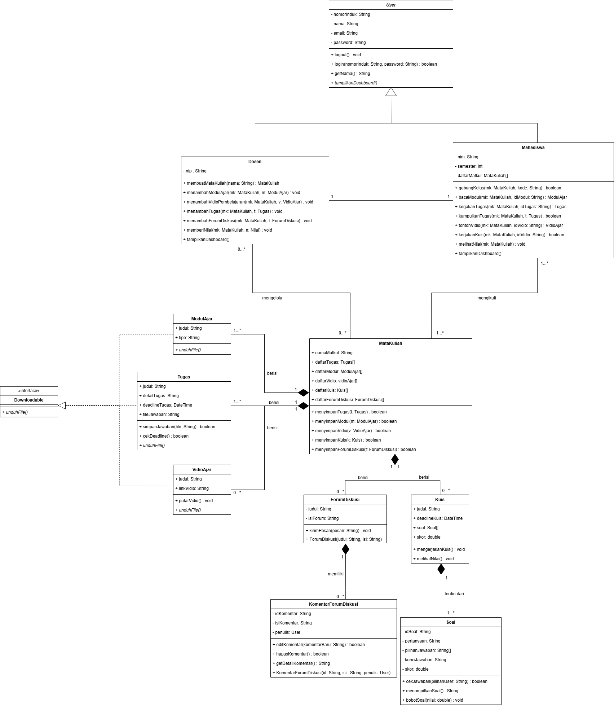

# Dial Ajar - Learning Management System

## Dosen Pengampu

Ibu Putri Nurika Adila, S.Kom., M.Kom

## Anggota Kelompok

1. Moch Firmansyah - 103012400137
2. Listianto Hilmi Fauzaan - 103012400094
3. Muhammad Daffa - 103012400110
4. Muhammad Lutfi Fitriansyah - 103012400237
5. Junior Mourits Hotty - 1030124174

## Deskripsi Aplikasi

**Dial Ajar** adalah sebuah platform _Learning Management System (LMS)_ modern yang memfasilitasi interaksi belajar mengajar antara Dosen dan Mahasiswa. Aplikasi ini menyediakan sistem manajemen mata kuliah, distribusi materi ajar (dokumen PDF/Word & Video), sistem evaluasi (tugas & kuis otomatis), hingga forum diskusi interaktif secara _real-time_. Antarmuka dirancang dengan responsivitas tinggi (_Mobile-Friendly_) dan dipadukan dengan animasi modern yang halus untuk pengalaman pengguna terbaik.

## Framework & Teknologi Utama

- **Frontend**: React (Vite) + Tailwind CSS
- **Backend**: Java Spring Boot (Web, Data JPA, Security)
- **Database**: MySQL

## Library & Dependensi

### Frontend

- **Zustand** (Manajemen State)
- **@tanstack/react-query** (Pengambilan Data & Caching)
- **Axios** (Klien HTTP)
- **GSAP** (Animasi UI/UX Modern)
- **react-router-dom** (Navigasi / Routing antar halaman)
- **lucide-react** (Kumpulan Ikon SVG ringan)
- **react-datepicker** & **date-holidays** (Komponen Kalender dan pencarian hari libur Indonesia)
- **mammoth** (Pratinjau ekstraksi dokumen)

### Backend

- **io.jsonwebtoken (JWT)** (Autentikasi & Otorisasi Token)
- **Spring Security** (Keamanan akses API)
- **Spring Data JPA** (Pemetaan Objek Database / ORM)
- **MySQL Connector J** (Driver penyambung ke MySQL)

## Fitur-Fitur Tersedia

1. **Sistem Autentikasi & Hak Akses Berjenjang**
   - Registrasi & Login menggunakan JWT.
   - Akses Dosen & Mahasiswa yang terpisah (Role-Based Access Control).
2. **Manajemen Kelas / Mata Kuliah**
   - Dosen dapat membuat kelas baru.
   - Mahasiswa dapat bergabung ke kelas menggunakan _Kode Kelas_.
3. **Materi Pembelajaran & Modul**
   - Mengunggah & mengunduh berkas (PDF / Word).
   - Menautkan Video Ajar (URL atau Unggah langsung).
4. **Sistem Evaluasi (Tugas & Kuis)**
   - Dosen dapat memberikan tugas (esai / unggah file).
   - Dosen dapat membuat kuis yang dilengkapi soal pilihan ganda maupun esai.
   - Kuis Pilihan Ganda memiliki **penilaian otomatis (Auto-Grading)**.
   - Tabel Penilaian (_Gradebook_) khusus untuk dosen menilai pekerjaan.
5. **Forum Diskusi**
   - Pembuatan utas (_thread_) baru per mata kuliah.
   - Sistem komentar dan balasan diskusi terpadu antar pengguna.
6. **Kalender Akademik Pintar**
   - Secara dinamis menarik semua data Tenggat Waktu (_Deadline_) Tugas & Kuis dari _database_.
   - Terintegrasi secara otomatis dengan **Hari Libur Nasional Indonesia** (Tanggal Merah).

## Class Diagram



## Cara Instalasi & Penggunaan

### Persyaratan Sistem Utama

- **Java 21** atau versi terbaru.
- **Maven** (Bawaan wrapper tersedia).
- **Node.js** (Minimal v18 ke atas).
- **MySQL Server** aktif dan berjalan.

### 1. Menyiapkan Database (Otomatis)

1. Pastikan Anda sudah menginstal **XAMPP** (atau aplikasi MySQL sejenisnya).
2. Buka XAMPP Control Panel, lalu klik **Start** pada modul **MySQL** dan **Apache**.
3. Selesai! Anda tidak perlu membuat database secara manual karena sistem akan membuatnya secara otomatis dengan nama `lms_pbo`.

### 2. Menjalankan Backend (Menggunakan Terminal / CMD)

Berikut adalah langkah-langkah detail agar tidak terjadi _error_:

1. Buka aplikasi **Terminal**, **Command Prompt (CMD)**, atau **PowerShell** di komputer Anda.
2. Arahkan direktori terminal tersebut ke dalam folder `backend` dari repositori ini. Anda bisa menggunakan perintah `cd`:
   ```bash
   cd path/ke/folder/dial-ajar-lms/backend
   ```
   _(Pastikan terminal Anda benar-benar berada di dalam folder `backend` sebelum melanjutkan ke langkah berikutnya)._
3. Ketik perintah berikut untuk mengunduh dependensi dan menjalankan server Spring Boot:
   - **Bagi Pengguna Windows:**
     ```cmd
     .\mvnw spring-boot:run
     ```
   - **Bagi Pengguna Mac/Linux:**
     ```bash
     ./mvnw spring-boot:run
     ```
4. Tekan **Enter** dan tunggu beberapa saat. Proses ini mungkin memakan waktu beberapa menit saat pertama kali dijalankan karena Maven harus mengunduh paket-paket yang dibutuhkan.
5. Jika di terminal sudah muncul tulisan `Started LmsApplication in ... seconds` (tanpa ada tulisan _ERROR_ merah), artinya Backend API sudah sukses berjalan di alamat `http://localhost:8080`. Jangan tutup terminal ini selama Anda masih ingin menggunakan aplikasi.

### 3. Menjalankan Frontend (React Vite)

1. Buka jendela terminal yang baru (jangan tutup terminal backend sebelumnya) lalu arahkan ke _folder_ `frontend`:
   ```bash
   cd frontend
   ```
2. Install seluruh dependensi paket Node dengan perintah:
   ```bash
   npm install
   ```
3. Mulai server pengembangan (_development server_):
   ```bash
   npm run dev
   ```
4. Terminal akan memberikan alamat lokal (biasanya `http://localhost:5173`). Buka _link_ tersebut di browser Anda (Google Chrome/Edge/Firefox).

### Akun Testing (Demo)

Aplikasi ini sudah menyediakan data uji coba (seeder) yang bisa Anda gunakan langsung untuk login:

**Akun Dosen:**

- **NIP:** `101`, `102`, `103`, `104`, atau `105`
- **Password:** `dosen123`

**Akun Mahasiswa:**

- **NIM:** `201`, `202`, `203`, ... sampai `2010`
- **Password:** `mhs123`

---
